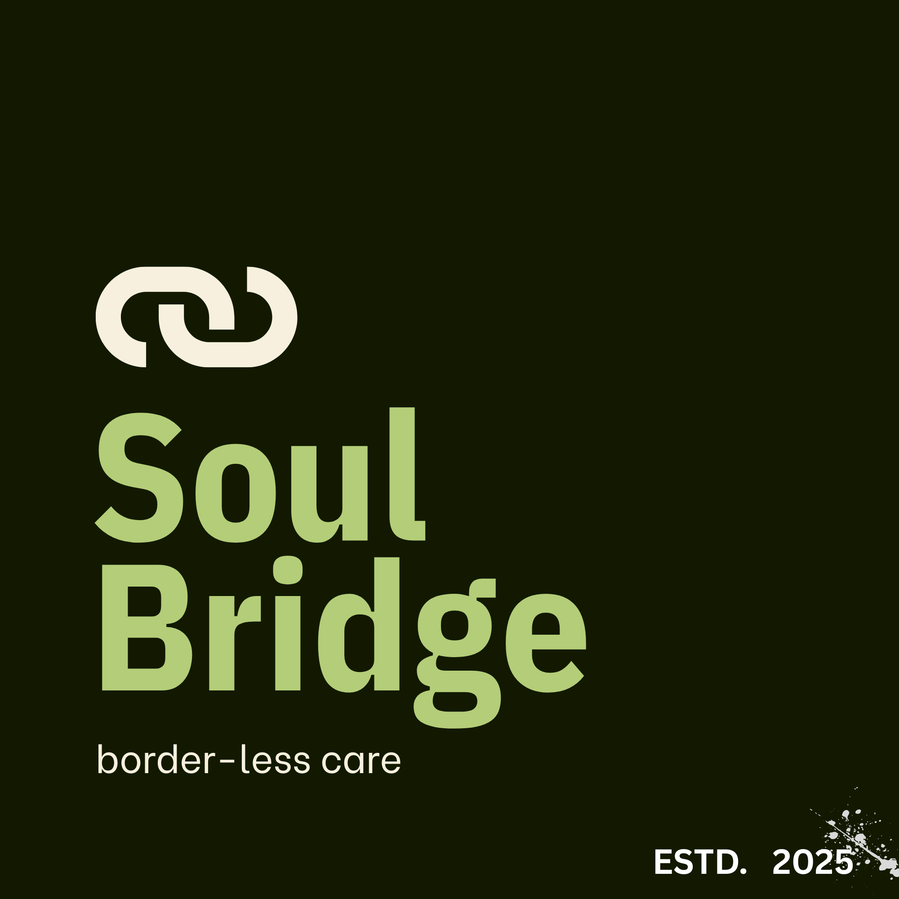

<div align="center">



# SoulBridge

### Healthcare Payments Without Borders

**AI-powered bill intelligence · USDC blockchain settlement · Direct hospital confirmation**

[](https://soul-bridgewaitlist-page.vercel.app/)
[](LICENSE)
[](https://x.com/itsHanshal)

---

*When a loved one is hospitalized abroad, families shouldn't have to fight the payment system at the same time.*

</div>

---

## The Problem

Every year, millions of diaspora families face a crisis no existing financial product was built to handle:

> A parent is admitted to a hospital thousands of miles away. The hospital needs payment — now. The bank needs 3–5 days. The medical bill is 47 lines of clinical codes nobody can read. There is no way to verify the charges before the money leaves.

**The gap isn't money. It's infrastructure.**

| What families try | Why it fails in a crisis |
|---|---|
| Bank wire transfer | Takes 3–5 business days. Hospitals can't wait. |
| Insurance | Requires pre-enrollment. Claim processing takes weeks. |
| Bank loan | Requires credit check. Takes days to approve. |
| Remittance apps | Moves money but can't read bills, verify charges, or confirm hospital receipt. |
| Borrow from family | Informal, unreliable, creates social pressure, still needs cross-border transfer. |

None of these were built for **the moment a human being is lying in a hospital bed abroad**.

---

## The Solution

SoulBridge is the **financial infrastructure layer for global healthcare** — purpose-built for this exact problem.

```
Upload Bill → AI Analyzes → You Verify → USDC Payment → Hospital Confirms
     ↓              ↓              ↓              ↓               ↓
  Any bill    Plain language   Full report   Minutes, not   Immutable
  format      explanation      with flags    days           blockchain
                                                            record
```

### Three Core Pillars

#### 🧠 AI Bill Intelligence
- Upload any hospital bill (photo, scan, PDF)
- AI explains every line item in plain language
- Detects duplicate charges, missing information, anomalies
- Generates full verification report before you pay a single rupee

#### ⚡ Instant Cross-Border Payments (USDC)
- Payments settle in minutes, not business days
- USDC tracks the U.S. dollar — no volatility risk during payment
- Lower transaction costs than traditional international wire transfers
- Every transaction recorded on-chain: immutable, auditable, tamper-proof

#### 🏥 Dual-Side Platform
- **Family Workspace** — track all medical payments, store bills, add family members, stay coordinated across geographies
- **Hospital Portal** — receive verified payments, real-time confirmation, clean audit trail
- **Emergency Mode** — complete a payment in under 3 minutes when every second counts

---

## Payment Flow

```
User Login
    │
    ▼
Upload Hospital Bill
    │
    ▼
AI Bill Analysis
(Plain-language explanation, duplicate detection, anomaly flagging)
    │
    ▼
Verification Report Generated
    │
    ▼
User Reviews & Approves Payment
    │
    ▼
USDC Payment Initiated
    │
    ▼
Blockchain Settlement (minutes)
    │
    ▼
Hospital Receives Confirmation
    │
    ▼
Transaction History Updated (both sides)
```

---

## Why USDC?

SoulBridge uses **USDC (USD Coin)** as its settlement layer because:

- ✅ **Stable value** — tracks the U.S. dollar, no volatility risk during payment
- ✅ **Fast settlement** — minutes, not business days
- ✅ **Lower costs** — significantly cheaper than traditional international wire transfers
- ✅ **Transparent** — every transaction is on-chain and auditable
- ✅ **Broad support** — widely supported across global markets and exchanges

---


## Security

SoulBridge is built compliance-first:

- 🔐 **End-to-end encryption** — all payment data and medical documents encrypted in transit and at rest
- 🧾 **Immutable records** — every payment generates a tamper-proof, blockchain-backed transaction record
- 🛡️ **AI fraud detection** — anomaly detection runs on every bill before any payment is approved
- 🔒 **Identity verification** — users and hospitals verified before any transaction can be initiated


## Roadmap

### Now — Waitlist & Validation
- [x] Waitlist website live
- [x] Core concept validated with diaspora community
- [ ] 100 waitlist signups
- [ ] 5 hospital conversations

### Phase 1 — MVP
- [ ] AI bill analysis (GPT-4 + medical billing data)
- [ ] USDC payment integration (Circle API)
- [ ] Basic family dashboard
- [ ] Hospital payment confirmation portal
- [ ] 3 pilot hospital partnerships

### Phase 2 — Scale
- [ ] Emergency Mode (< 3 min payment flow)
- [ ] Multi-currency support
- [ ] Mobile apps (iOS + Android)
- [ ] Insurance integrations
- [ ] 10+ hospital partnerships

### Phase 3 — Infrastructure
- [ ] Government hospital integration
- [ ] Medical document vault
- [ ] Health expense analytics
- [ ] International hospital verification network


## About the Founder

**Hanshal Gajula** — Founder, SoulBridge

CS student specializing in AI & ML at Universal AI University, India. Building at the intersection of healthcare, fintech, and blockchain.

I started SoulBridge because healthcare payments shouldn't be the thing that breaks a family during a medical crisis. The infrastructure for global healthcare payments largely doesn't exist yet. I'm building it.

Three forces make this the right moment — AI that can genuinely interpret medical documents, digital payment rails that enable near-instant international settlement, and healthcare going digital worldwide. **SoulBridge sits at that intersection.**

[](https://www.linkedin.com/in/hanshal-gajula/)
[](https://github.com/Hanshal-aether)
[](https://x.com/itsHanshal)

---

**[Join the waitlist](https://soul-bridgewaitlist-page.vercel.app/) or reach out directly at support.soulbridge@gmail.com**

---

## License

MIT License 

---

<div align="center">

**SoulBridge** · *border-less care* · ESTD. 2025

[Website](https://soulbridge.netlify.app) · [Contact](mailto:support.soulbridge@gmail.com) · [Twitter/X](https://x.com/itsHanshal)
